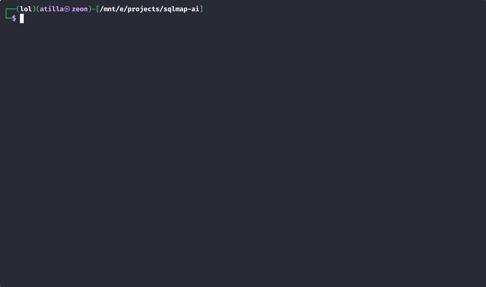

# SQLMap AI Assistant

An AI-powered wrapper around SQLMap that makes SQL injection testing more accessible and automated.

## Features

### Core Features
- **AI-Assisted Testing** - Intelligent vulnerability analysis and recommendations
- **Adaptive Testing** - Step-by-step testing that adapts to target responses
- **Enhanced HTML Reports** - Beautiful, detailed reports with vulnerability details
- **Parameter Targeting** - Test specific parameters with `-p` option (like original SQLMap)
- **WAF Bypass** - Automatic tamper script selection for firewall evasion
- **Database Enumeration** - Complete database, table, and column discovery
- **Request File Support** - Test from Burp Suite, ZAP, or browser captures

### AI Providers
- **Groq** - Fastest AI analysis (recommended)
- **DeepSeek** - Affordable and capable analysis
- **OpenAI** - GPT-4 powered analysis
- **Anthropic Claude** - Advanced reasoning
- **Ollama** - Local, private AI (no cloud required)

### New in v2.0.6
- [x] **Private Network Scanning** - Local/private IP targets now allowed by default
- [x] **Configurable Network Policy** - New `allow_private_networks` security setting
- [x] **Improved Test Coverage** - Added dedicated tests for private network validation

> See the full [Changelog](docs/CHANGELOG.md) for previous versions.



## Quick Start

**1. Install SQLMap:**
```bash
sudo apt install sqlmap    # Debian/Ubuntu/Kali
brew install sqlmap         # macOS
```

**2. Install SQLMap AI:**
```bash
pip install sqlmap-ai
sqlmap-ai --install-check
```

**3. Set an API key** in your `.env` file (e.g., Groq - free & fastest):
```bash
GROQ_API_KEY=your_groq_api_key_here
```

**4. Run:**
```bash
sqlmap-ai -u "http://example.com/page.php?id=1"
```

> See the full [Installation Guide](docs/INSTALLATION.md) for all providers and options.

## Documentation

| Guide | Description |
|-------|-------------|
| [Installation](docs/INSTALLATION.md) | Prerequisites, setup, AI provider configuration |
| [Usage](docs/USAGE.md) | Examples, testing modes, request files, workflows |
| [Configuration](docs/CONFIGURATION.md) | `.env`, `config.yaml`, command-line reference |
| [Troubleshooting](docs/TROUBLESHOOTING.md) | Common issues and getting help |
| [Changelog](docs/CHANGELOG.md) | Version history |

## Requirements

- Python 3.8+
- SQLMap (must be installed globally on your system)
  - Kali/Debian/Ubuntu: `sudo apt install sqlmap`
  - macOS: `brew install sqlmap`
  - From source: [github.com/sqlmapproject/sqlmap](https://github.com/sqlmapproject/sqlmap)
- Internet connection (for cloud AI providers)
- 2GB+ RAM (for Ollama local models)

## License

This project is licensed under the MIT License.

## Disclaimer

This tool is intended for educational and ethical hacking purposes only. Always obtain permission before testing any system or application. The developers are not responsible for any misuse or damage caused by this tool.

## Star History

[](https://www.star-history.com/#atiilla/sqlmap-ai&Date)
